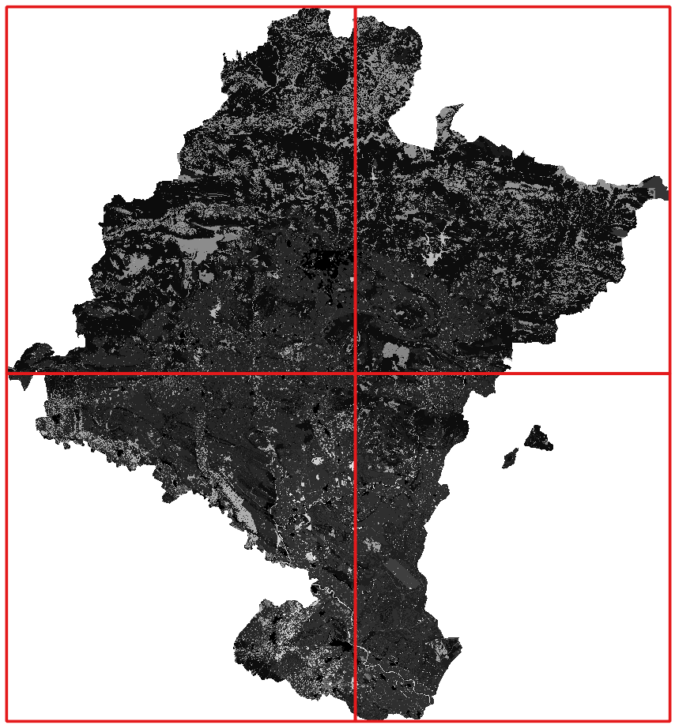
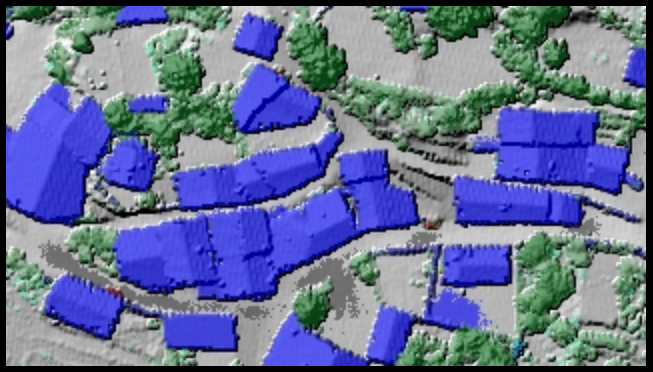
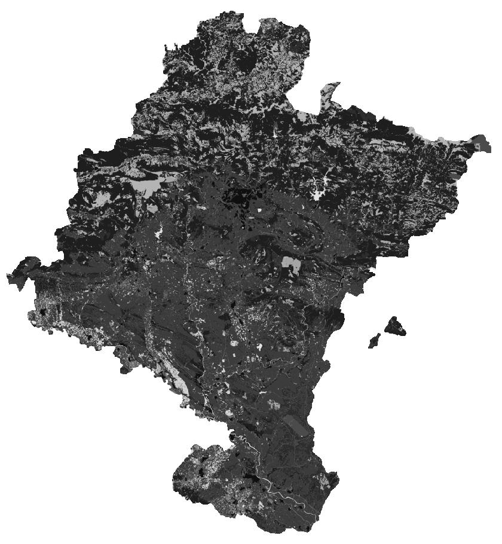
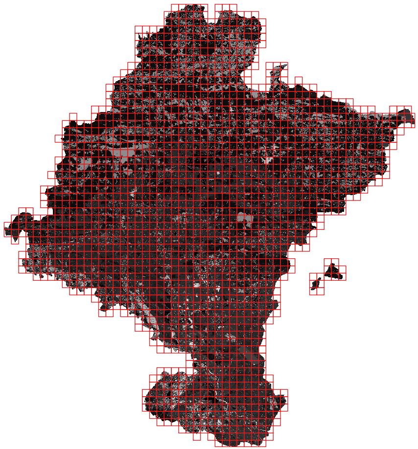

 # DuckDB Raster Extension Examples

This page contains examples of how to use the DuckDB Raster Extension. For more information on the available functions,
please refer to the [functions](functions.md) page.

Some of the examples below use sample data files that are included in the [`test/data`](../test/data/) folder of the repository, but you can use any raster file supported by GDAL, including remote files via HTTP or S3.

## Basic Usage

Open a GTiff file and read it as a data table:

```sql
SELECT * FROM RT_Read('./test/data/overlay-sample.tiff');
```

The `RT_Read` function provides a `datacube` option that returns a single `datacube` BLOB column containing
the N-dimensional array of all band data for the tile, instead of one BLOB column per band.

The `blocksize_x` and `blocksize_y` options allow you to override the block size defined in the raster file.

This command returns a table where each databand is 512x512 pixels, even if the original file has a different block size:

```sql
SELECT * FROM RT_Read('./test/data/overlay-sample.tiff', blocksize_x:=512, blocksize_y:=512);
```

Now, open a raster file from an S3 bucket, using the `/vsis3/` prefix to instruct GDAL virtual file system to read from S3:

```sql
SELECT RT_GdalConfig('AWS_NO_SIGN_REQUEST', 'YES');

SELECT
    *
FROM
    RT_Read('/vsis3/sentinel-cogs/sentinel-s2-l2a-cogs/30/T/WN/2021/9/S2B_30TWN_20210930_0_L2A/B02.tif')
LIMIT 5
;
```

Or using a remote path as DuckDB File System expects (Refer to `httpfs` extension documentation):

```sql
SELECT
    *
FROM
    RT_Read('s3://sentinel-cogs/sentinel-s2-l2a-cogs/30/T/WN/2021/9/S2B_30TWN_20210930_0_L2A/B02.tif')
LIMIT 5
;
```

Open multiple raster files as a mosaic, by passing an array of file paths to `RT_Read`:

```sql
SELECT
    x, y, bbox, geometry, level, tile_x, tile_y, cols, rows, metadata
FROM
    RT_Read([
        './test/data/mosaic/SCL.tif-land-clip00.tiff',
        './test/data/mosaic/SCL.tif-land-clip01.tiff',
        './test/data/mosaic/SCL.tif-land-clip10.tiff',
        './test/data/mosaic/SCL.tif-land-clip11.tiff'
    ])
;
```



When reading from multiple files, setting `separate_bands` to `true` places each input file into its own band in the VRT dataset. When `false` (the default), the files are treated as tiles of a larger mosaic and the VRT has the same number of bands as the input files.

## Creating new files

Creating new raster files is possible using the `COPY TO` statement by specifying `FORMAT RASTER` and the desired output format in
the `DRIVER` option.

Several creation options are available to control the output raster, check the [function reference](functions.md#rt_write) for more details and refer to the [GDAL documentation](https://gdal.org/drivers/raster/index.html) for the list of supported output formats (`DRIVER`) and their creation options (`CREATION_OPTIONS`).

```sql
COPY (
    SELECT * FROM RT_Read('./test/data/overlay-sample.tiff')
)
TO './test/data/copy_to_raster.png'
WITH (
    FORMAT RASTER,
    DRIVER 'PNG',
    CREATION_OPTIONS ('WORLDFILE=YES'),
    RESAMPLING 'nearest',
    ENVELOPE [545539.750, 4724420.250, 545699.750, 4724510.250],
    SRS 'EPSG:25830',
    GEOMETRY_COLUMN 'geometry',
    DATABAND_COLUMNS ['databand_3', 'databand_2', 'databand_1']
);
```


<p></p>

The same applies when writing a mosaic assembled from multiple raster files, for example:

```sql
COPY (
    SELECT
        *
    FROM
        RT_Read([
            './test/data/mosaic/SCL.tif-land-clip00.tiff',
            './test/data/mosaic/SCL.tif-land-clip01.tiff',
            './test/data/mosaic/SCL.tif-land-clip10.tiff',
            './test/data/mosaic/SCL.tif-land-clip11.tiff'
        ])
)
TO './test/data/copy_to_cog.tiff'
WITH (
    FORMAT RASTER,
    DRIVER 'COG',
    CREATION_OPTIONS ('COMPRESS=LZW'),
    RESAMPLING 'nearest',
    SRS 'EPSG:25830',
    GEOMETRY_COLUMN 'geometry',
    DATABAND_COLUMNS ['databand_1']
);
```


<p></p>

Because input rows have the `geometry` column, you can invoke spatial functions, or write them into
new geoparquet files or vector files (via `spatial` extension), for example:

```sql
LOAD spatial;

-- Write to a GeoParquet file
COPY (
    SELECT
        id, x, y, tile_x, tile_y, cols, rows, geometry, metadata
    FROM
        RT_Read([
            './test/data/mosaic/SCL.tif-land-clip00.tiff',
            './test/data/mosaic/SCL.tif-land-clip01.tiff',
            './test/data/mosaic/SCL.tif-land-clip10.tiff',
            './test/data/mosaic/SCL.tif-land-clip11.tiff'
        ])
    WHERE
        NOT RT_CubeNullOrEmpty(databand_1)
)
TO './test/data/copy_to_geoparquet.parquet'
WITH (
    FORMAT PARQUET, GEOPARQUET_VERSION 'V1'
);

-- Write to a GeoPackage file
COPY (
    SELECT
        id, x, y, tile_x, tile_y, cols, rows, geometry, metadata
    FROM
        RT_Read([
            './test/data/mosaic/SCL.tif-land-clip00.tiff',
            './test/data/mosaic/SCL.tif-land-clip01.tiff',
            './test/data/mosaic/SCL.tif-land-clip10.tiff',
            './test/data/mosaic/SCL.tif-land-clip11.tiff'
        ])
    WHERE
        NOT RT_CubeNullOrEmpty(databand_1)
)
TO './test/data/copy_to_geopackage.gpkg'
WITH (
    FORMAT GDAL, DRIVER 'GPKG', SRS 'EPSG:32630'
);
```



## Algebraic Operations

You can perform algebraic operations on databands. Several built-in [functions](functions.md#rt_cubebinaryop)
cover common operations, and the standard arithmetic operators (`+`, `-`, `*`, `/`) are also supported:

```sql
SELECT
    databand_1 + databand_2 AS res,
    RT_CubAdd(databand_1, databand_2) - 1.8 AS res_func,
    databand_1 * 2 AS res_mul,
FROM
    RT_Read('./test/data/overlay-sample.tiff')
;
```

## Spatial Queries

You can use the `geometry` column to perform spatial queries — for example, to retrieve all raster tiles that intersect a given geometry:

```sql
WITH __clip_layer AS (
    SELECT geom FROM ST_Read('./test/data/CATAST_Pol_Township-PNA.geojson')
),
__dataset AS (
    SELECT
        id, x, y, tile_x, tile_y, cols, rows, geometry, databand_1, metadata
    FROM
        __clip_layer,
        RT_Read([
            './test/data/mosaic/SCL.tif-land-clip00.tiff',
            './test/data/mosaic/SCL.tif-land-clip01.tiff',
            './test/data/mosaic/SCL.tif-land-clip10.tiff',
            './test/data/mosaic/SCL.tif-land-clip11.tiff'
        ])
    WHERE
        ST_Intersects(__clip_layer.geom, geometry)
)
SELECT * FROM __dataset;
```

The `bbox` column holds the tile's bounding box as `[minx, miny, maxx, maxy]`. You can filter on it for faster spatial queries without loading the full `geometry` column:

```sql
SELECT
    *
FROM
    RT_Read('./test/data/overlay-sample.tiff')
WHERE
    bbox.xmin >  545500.0 AND bbox.xmax <  545800.0
    AND
    bbox.ymin > 4724400.0 AND bbox.ymax < 4724600.0
;
```

## End-to-End Earth Observation Analysis

This section walks through a complete workflow for extracting information from *Earth Observation* (EO) data. It uses the [STAC API](https://stacspec.org/) to discover EO products in a Data Catalog, then performs a simple arithmetic operation to compute the *NDVI* index.

The query filters products by a given *area of interest* (AOI) and a *date range*, reads the `red` and `near-infrared` bands of the first matching product, computes the `NDVI` index, and writes the result to a new `COG` file.

Before presenting the complete end-to-end query, the sections below walk through each step individually — starting with a basic STAC search, then adding AOI filtering, and finally combining everything.

Discovering EO products is straightforward — issue a search HTTP request to a [STAC API](https://stacspec.org/) Data Catalog and parse the response.

The examples below search for *Sentinel-2 L2A* products. To use a different collection, update the `collections` parameter in the search request and adjust the band names in subsequent steps accordingly.

```sql
LOAD json;
LOAD spatial;
INSTALL http_client FROM community;
LOAD http_client;

WITH __input AS (
    -- Make an HTTP GET request to a STAC API endpoint to search for EO products.
    SELECT
        http_get('https://earth-search.aws.element84.com/v0/search') AS res
),
__features AS (
    -- Parse the response body as JSON and extract the 'features' array, then unnest it to get individual features.
    SELECT
        unnest( from_json(((res->>'body')::JSON)->'features', '["json"]') ) AS features
    FROM
        __input
)
SELECT
    -- Extract relevant information from the features.
    features->>'id' AS id,
    features->'properties'->>'sentinel:product_id' AS product_id,
    concat(
        'T',
        features->'properties'->>'sentinel:utm_zone',
        features->'properties'->>'sentinel:latitude_band',
        features->'properties'->>'sentinel:grid_square'
    ) AS grid_id,
    ST_GeomFromGeoJSON(features->'geometry') AS geom
FROM
  __features
;
```

To filter products by AOI intersection and date range, use an HTTP POST with a GeoJSON geometry payload:

```sql
LOAD json;
LOAD spatial;
INSTALL http_client FROM community;
LOAD http_client;

WITH __aoi AS (
    -- Load the AOI geometry from a GeoJSON file, in this case, a polygon representing a township in the province of Navarra, Spain.
    SELECT
        geom
    FROM
        ST_Read('./test/data/CATAST_Pol_Township-PNA.geojson')
),
__geojson AS (
    -- Transform the geometry to WGS84 (EPSG:4326) and convert it to GeoJSON format, as required by the STAC API endpoint.
    SELECT
        ST_AsGeoJSON( ST_Transform(geom, 'EPSG:32630', 'EPSG:4326', always_xy := true) ) AS g
    FROM
        __aoi
    LIMIT 1
),
__input AS (
    -- Make an HTTP POST request to the STAC API, filtering by AOI intersection and date range.
    SELECT
        http_post('https://earth-search.aws.element84.com/v0/search',
            headers => MAP {
                'Content-Type': 'application/json',
                'Accept-Encoding': 'gzip',
                'Accept': 'application/geo+json'
            },
            params => {
                'collections': ['sentinel-s2-l2a-cogs'],
                'datetime': '2021-09-30/2021-09-30',
                'intersects': (SELECT g FROM __geojson),
                'limit': 16
            }
    ) AS data
),
__features AS (
    -- Parse the response body as JSON and extract the 'features' array.
    SELECT
        unnest( from_json( (data->>'body')->'features', '["json"]') ) AS features
    FROM
        __input
)
SELECT
    -- Extract relevant information from the features.
    features->>'id' AS id,
    features->'properties'->>'sentinel:product_id' AS product_id,
    concat(
        'T',
        features->'properties'->>'sentinel:utm_zone',
        features->'properties'->>'sentinel:latitude_band',
        features->'properties'->>'sentinel:grid_square'
    ) AS grid_id,
    [
        features->'assets'->'B02'->>'href',
        features->'assets'->'B03'->>'href',
        features->'assets'->'B04'->>'href'
    ] AS bands,
    ST_GeomFromGeoJSON(features->'geometry') AS geom
FROM
  __features
;
```

The `NDVI` index is computed with the formula `(NIR - RED) / (NIR + RED)`. Here `B08` is the NIR band and `B04` is the RED band. Both are read in a single `RT_Read` call using `separate_bands := true` so each file maps to its own databand.

The example below reads `B08` and `B04` for a specific product, computes NDVI for every tile, and writes the result as a Cloud-Optimized GeoTIFF (`COG`).

```sql
COPY (
    WITH __input AS (
        -- Read the NIR (B08) and RED (B04) bands using separate_bands := true so each file becomes its own databand.
        SELECT
            geometry, databand_1 AS nir, databand_2 AS red,
        FROM
            RT_Read(
                [
                    '/vsis3/sentinel-cogs/sentinel-s2-l2a-cogs/30/T/WN/2021/9/S2B_30TWN_20210930_0_L2A/B08.tif',
                    '/vsis3/sentinel-cogs/sentinel-s2-l2a-cogs/30/T/WN/2021/9/S2B_30TWN_20210930_0_L2A/B04.tif'
                ],
                separate_bands := true,
                blocksize_x := 1024,
                blocksize_y := 1024
            )
    )
    -- Calculate the NDVI index using the formula (NIR - RED) / (NIR + RED) and convert it to float type.
    SELECT
        geometry, RT_Cube2TypeFloat( (nir-red) / (nir+red) ) AS ndvi
    FROM
        __input
)
TO './test/data/ndvi.tiff'
WITH (
    FORMAT RASTER,
    DRIVER 'COG',
    CREATION_OPTIONS ('COMPRESS=LZW'),
    RESAMPLING 'nearest',
    SRS 'EPSG:32630',
    GEOMETRY_COLUMN 'geometry',
    DATABAND_COLUMNS ['ndvi']
);
```

TODO
